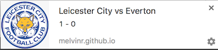

#Final Assignment - Browser Technologies
[Link to live demo 2](http://melvinr.github.io/Browser%20Technologies/Week%203-versie%202/index.html)

##Enhancement: Notifications API
The Notifications API is a great way to keep your user up-to-date on certain subjects, by sending them a web notification. For instance when his or her favorite football club has scored.

A problem with the Notifications API is that it's not that well supported, especially on mobile devices. As can be seen on the screenshot from caniuse.com below.

##Use Case: I want to receive a notification when my favorite football team has scored.
To build a demo for this use case, I followed the principle of **progressive enhancement**. This means that you build your website or application in three layers: HTML, CSS and finally JavaScript. I started out by creating the HTML for the website. By using semantically correct HTML and adding scores, the user can still see the result, even when they don't have any CSS or JavaScript. This is the most basic version of the application. For this demo, the page uses `http-equiv`'s refresh to go to a different page, containing a different score. These scores form the data that will be used in the notifications.

Then I started by adding some CSS to enhance the website and give it a more pleasant look. After this I started working on its enhanced feature: notifications. Because the notifications API is not well supported on mobile devices, the application starts out by checking whether or not it's supported. Then it will continue by checking the html pages that would come next in the http-equiv's refresh. From these pages, it will grab the score and render this in the index.html, as well as create a notification.

**Screenshot of the live score**

 

**Screenshot of a notification**

 
